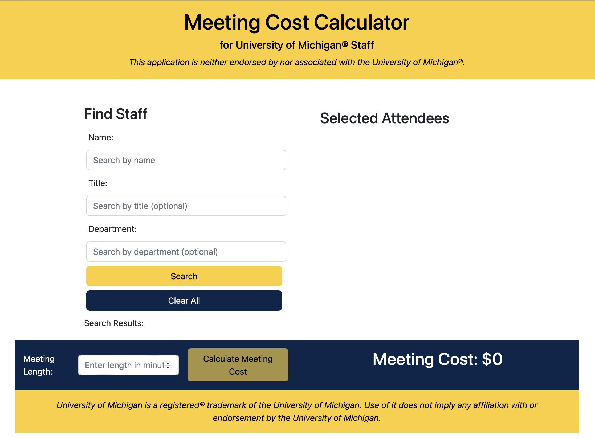

# Meeting Cost Calculator for University of Michigan® Staff

## Summary

This is an application for calculating the cost of meetings that include University of Michigan staff.  

---


<em><sub>The application on startup</sub></em>

---

## Description

The purpose of this application is to provide an easy means of calculating the cost of one or more University of
Michigan staff attending any particular meeting. By choosing meeting attendees and entering the meeting's length, the
user can see the actual cost of the meeting in terms of how much the University is spending on their salaries to have
the attendees there.

## Inspiration

There's a lot of value to be realized in measuring the cost of meetings, because it gives us a metric we can use to help
us see the return-on-investment of staff time. When combined with other metrics (like the presence and quality of
an agenda; the number or business traits of the attendees; the number of actionable items in the minutes; etc.), we have
a powerful means of studying the business value of both individual meetings and of meeting trends over time.

## Technical Details

This is a [react](https://reactjs.org)-based UI that uses the [um_mcc](https://github.com/whorvath2/um_mcc) REST API to
calculate the cost of a meeting that includes University of Michigan staff. It
leverages [publicly available salary data](https://www.dropbox.com/s/ti4iff026agzpak/salary-disclosure-2022.pdf?dl=0) to
enable the search and selection of meeting attendees and the calculation of meeting cost.

## Dependencies

This application's services (the UI and the back end) can be run independently, however it's designed to run in a VM
capable of running containerized applications, such as [podman](https://podman.io/getting-started/installation).
The [compose](compose.yaml) file enables orchestration tools
like [podman-compose](https://github.com/containers/podman-compose) to launch the entire suite of services together.

## Containerized Build and Execution

To build the container image for the UI, open a terminal session in this directory and build the image:

```
podman build --tag um_mcc_ui_image .
```

To operate the entire application using your orchestration tool (`podman-compose` in this example), you'll also need to
clone the API and build a container for it as well.

```
git clone https://github.com/whorvath2/um_mcc.git
cd um_mcc
podman build --tag um_mcc_image .
```

To launch the application in the same terminal session:

```
cd ../
podman-compose up -d
```

To see the application, [open your browser to localhost:3000](http://localhost:3000/).

## Manual Build and Execution

To build and run the applications manually, you will need the current release
of [Python](https://www.python.org/downloads/) for the API and [NodeJS](https://nodejs.org/en/download/) for the UI.
After they are installed, open a terminal session in this directory, clone the API, then run both the API and the UI:

```
# Clone the API
git clone https://github.com/whorvath2/um_mcc.git

# Create and activate a virtual python environment
cd um_mcc
python3 -m venv .venv
source .venv/bin/activate

# Run the API in the background
cd src
python co/deability/um_mcc/app.py &

# Install the UI
cd ../../
npm install

# Run the UI in the foreground; Ctrl-C when you're done will end the UI process
npm start

# Note that you'll also need to kill the API's process after you're done with the UI:
sid=$(lsof -i :8000 | awk 'NR>1' | awk '{print $2}')
kill $sid
```

To see the application, [open your browser to localhost:3000](http://localhost:3000/).

## Version

1.3.3

## Disclaimers

**THIS APPLICATION IS NEITHER ENDORSED BY NOR ASSOCIATED WITH THE UNIVERSITY OF MICHIGAN®.**

University of Michigan, UM, U-M, and U of M are trademarks™ or registered® trademarks of the University of Michigan. Use
of them does not imply any affiliation with or endorsement by the University of Michigan. **For all other
disclaimers, including limitations of liability and a disclaimer of
warranty, [see the LICENSE file in this repository](LICENSE).**

_Thank you [termly.io](https://termly.io) for the disclaimer language._

_Copyright ©️ 2023 William L Horvath II_
